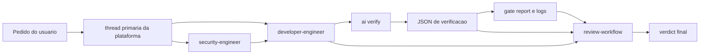

# Agents Directory

This directory contains the operational framework for AI agents in the project.

## Escopo — leia antes de tudo

Este diretorio e **tooling interno de desenvolvimento**, nao faz parte do
produto. Nao confunda as duas coisas que a palavra "agent" nomeia aqui:

| | O que e | Onde vive | Publicado? |
| --- | --- | --- | --- |
| **Produto** | `createagents`, biblioteca Python para construir agentes conversacionais | `src/`, `docs/`, `tests/` | sim, PyPI |
| **Harness** | subagents, skills e workflows que assistem quem programa o produto | `.agents/` e espelhos ocultos | **nao** |

Consequencias praticas:

- `.agents/`, `.claude/`, `.opencode/`, `opencode.json` e `.github/agents/` estao
  no `.gitignore`. O harness fica local ao checkout e nao vai para o repositorio
  publico.
- O build (`uv build`) empacota apenas `src/` via
  `[tool.setuptools.packages.find] where = ["src"]`. Nada daqui entra no wheel.
- Como o git ignora estes caminhos, `npm run ai:verify` nao os enxerga na
  descoberta automatica de diff. Valide mudancas no harness com
  `--changed-file`; veja [verification-harness.md](./verification-harness.md).
- Nada em `.agents/` deve descrever, documentar ou versionar comportamento da
  biblioteca. Isso pertence a `docs/` e ao `AGENTS.md`.

## Documentation Boundary

- `AGENTS.md` is the global repo manual: product context, code navigation, architecture maps, technical invariants, and the canonical execution policy (process, safety, autonomy, validation) under its `Execution Policy` section.
- `.agents/README.md` is the framework manual: agent ownership, prompts, manifests, workflows, mirrors, and local runtime policies.

## Structure

- `../AGENTS.md`: Manual global do repo para contexto do produto, mapas de arquitetura, invariantes do sistema e a policy canonica de execucao (secao `Execution Policy`).
- `agents/`: Subagents invocáveis. Cada agent tem um prompt autocontido em `*.agent.md` com Identity, Can Do, Cannot Do e Done When.
- `skills/`: Capacidades reutilizáveis acionáveis, cada uma com metadata canônica em `SKILL.md`.
- `runtime/`: Suporte compartilhado de execução que não é skill disparável, como o runtime do protocolo `review-workflow` e seus artefatos auxiliares.
- `verification-harness.md`: Guia amplo do runtime de validacao `ai:verify`, mantido fora da skill para evitar acoplamento da documentacao sistemica ao owner local.
- `workflows/`: Comandos e workflows invocáveis pelo usuário (slash commands) e rotinas padronizadas.
- `fixtures/`: Cenários estáticos, estáveis de teste e demonstração versionada.
- `sessions/`: Runtime local temporário, gerado por testes ou execuções. Não é considerado fonte de verdade.

## Active Agents

| agent                | papel principal                      | entra quando                                                           |
| -------------------- | ------------------------------------ | ---------------------------------------------------------------------- |
| `developer-engineer` | implementa e integra codigo          | feature, bugfix, refactor e remediacao                                 |
| `security-engineer`  | faz julgamento terminal de seguranca | existe toque material de auth, permissao, secrets ou boundary sensivel |

## Quick Start

Se voce so quer se orientar rapido:

1. Quer implementar: pense em `developer-engineer`.
2. Quer planejar antes: use o modo de planejamento nativo da plataforma
   (Plan Mode ou equivalente) antes de acionar o `developer-engineer`.
3. Quer revisar entrega: use `developer-engineer` com a skill `review-workflow`.
4. Quer validar diff de forma deterministica: rode `npm run ai:verify`.
5. Se nao estiver claro quem deveria assumir, a thread primaria da plataforma decide o fluxo e delega ao owner certo.

## How The Agents Work Together

O sistema agora é mais simples que a geração anterior: validação determinística não sai de um agent dedicado. Ela sai do harness `ai:verify`.



Fallback texto:

```text
pedido
  -> thread primaria escolhe o owner
       -> developer-engineer
       -> security-engineer

developer-engineer
  -> ai:verify
  -> JSON de verificacao
  -> gate report e logs
  -> review-workflow
  -> verdict final
```

Em termos práticos:

- A thread primaria da plataforma organiza ownership; nao ha agent coordenador separado.
- `developer-engineer` e o owner normal de entrega e do closeout de review quando solicitado.
- `ai:verify` faz a validacao mecanica.
- `review-workflow` fecha a leitura humana do diff e dos artifacts como skill, nao como agente separado.
- `security-engineer` entra por tipo de risco, nao por burocracia.

## Skill Routing

Skills sao o caminho padrao do trabalho que elas cobrem, nao decoracao opcional:
`developer-engineer.agent.md` exige confiar nelas e usa-las. Carregue a skill
**antes** de improvisar um processo.

[skill-index.md](./skill-index.md) e gerado por `npm run sync:skills` e lista a
`description` completa de cada skill ativa — e catalogo, nao roteamento. A tabela
abaixo e o roteamento **deste** repositorio: qual tarefa carrega qual skill.

| Quando a tarefa e… | Carregue |
| --- | --- |
| Causa raiz desconhecida: erro de import, teste flaky, passa local e falha no CI | `systematic-debugging` |
| Regressao que precisa de teste falhando antes do fix, ou refactor a proteger | `tdd-workflow` |
| Decidir o que assertar, unit vs integracao, mocks, fixtures, cobertura fraca | `testing-patterns` |
| Python idiomatico: typing, async/streaming, traducao de excecao, dataclasses, lifecycle de recurso | `python-patterns` |
| Onde isso mora: fronteira de camada, porta nova vs adapter novo, acoplamento, ADR | `architecture` |
| God file ou modulo duplicado que precisa de split auditavel (ex.: `infra/adapters/Tools/Read_Local_File_Tool/file_utils.py`) | `modularizar` |
| Rodar as gates e produzir evidencia de terminal antes de fechar | `lint-and-validate` |
| Ler um diff antes de fechar: plano por risco, findings, verdict, gate-report | `review-workflow` |
| Transformar uma mudanca delimitada em passos ou handoff | `plan-writing` |
| Ainda explorando; a direcao nao foi escolhida | `brainstorming` |
| Arquivo, encoding ou delimitador desconhecido — territorio do `ReadLocalFileTool` | `structural-inspector` |
| Auditar tratamento de secrets, credenciais de provedor, supply chain | `vulnerability-scanner` |
| Provar se um HIGH/CRITICAL ja suspeito e mesmo exploravel | `red-team-tactics` |
| Criar ou revisar uma skill | `skill-governance` |
| Criar ou revisar o `AGENTS.md` | `agents-md-author` |
| Mudanca grande, multi-fase, que precisa de artefatos formais duraveis | `openspec-workflow` |

Duas skills instaladas **nao se aplicam aqui** e nao devem ser roteadas:

- `ui-ux`: nao ha produto visual. `presentation/cli/ui/color_scheme.py` e uma
  paleta ANSI, nao um design system.
- `webapp-testing`: nao ha web app, browser nem configuracao de Playwright.

Ao adicionar uma skill, rode `npm run sync:skills` para regenerar o
`skill-index.md` e atualize a tabela acima — o indice e automatico, o roteamento
nao.

### Escalacao para owner

O `ai:verify` devolve flags que decidem quem age em seguida:

| Flag | Quem assume |
| --- | --- |
| `securityRequired=true` | `security-engineer` — o julgamento sai do developer |
| `reviewRequired=true` | a mudanca nao fecha sem `review-workflow` |
| `testerRecommended=true` | continua com `developer-engineer`, apoiado por `tdd-workflow`/`testing-patterns` |

Uma gate `failed` ou `external_failure` liga `reviewRequired` por conta propria.
Classifique findings pela rubrica em
[runtime/review/review-rubric.md](./runtime/review/review-rubric.md): `blocker`
com confidence `high` ou `medium` bloqueia o verdict, `warning` nao bloqueia mas
entra no resumo, `nit` nunca bloqueia.

## Verification Harness

O harness operacional do caminho comum é `npm run ai:verify`.

- O harness decide `effectiveProfile`, gates e escalonamentos a partir do diff.
- `--dry-run` explica o que seria rodado sem executar os comandos.
- `--session-dir` persiste `gate-report` canônico para o `review-workflow` consumir depois.
- O unico entrypoint operacional suportado e `npm run ai:verify`.

Perfis disponíveis:

- `quick`: docs/config e validação rápida.
- `standard`: caminho comum de código de baixo ou médio risco.
- `high-risk`: contratos públicos, infra de agents e refactors amplos.
- `security-touch`: auth, API compartilhada e outros toques sensíveis.
- `ui-flow`: existe no runtime, mas **nenhum caminho deste repositório o aciona**
  — não há browser nem Playwright aqui.

O guia amplo do harness fica em [verification-harness.md](./verification-harness.md). A skill `lint-and-validate` fica com instrucao curta de uso e exemplos.

## Reading Order

Se você quer entender o sistema sem abrir o repo inteiro, esta ordem costuma bastar:

1. `AGENTS.md`
2. `.agents/README.md`
3. `.agents/verification-harness.md`
4. `.agents/agents/developer-engineer.agent.md`
5. `.agents/skills/review-workflow/SKILL.md`

## Policies

### Policy Source

- `AGENTS.md` (secao `Execution Policy`) é a fonte de verdade para processo, seguranca operacional, autonomia e defaults globais de execucao.
- `Codex`, `Copilot` e `Claude` consomem `AGENTS.md` diretamente como contexto global; nao ha policy espelhada em outro formato.

### Prompt and Mirror

- O prompt `*.agent.md` e autocontido: guarda `Identity`, `Can Do`, `Cannot Do` e `Done When`.
- Use `python3 .agents/scripts/sync-config-agents.py` para gerar todos os espelhos de agents a partir de `.agents/agents/`: `.claude/agents/*.md` (frontmatter minimo, sem `tools`), `.github/agents/*.agent.md` (frontmatter completo), `.codex/agents/*.toml` e o bloco `agent` de `opencode.json` (prompt compilado inline). Com `--check`, detecta drift sem escrever.
- Cada espelho aplica o packaging da sua plataforma (nome de arquivo, campos de frontmatter, dialeto de tools); o nucleo semantico e identico e vem do mesmo source.
- O harness de cada plataforma injeta automaticamente as descriptions das skills no contexto do agente; a decisao de qual skill carregar por tarefa esta em [Skill Routing](#skill-routing).

### Scripts, Templates and Schemas

- Assets auxiliares (`scripts/`, `templates/`, `schemas/`, `data/`) devem viver preferencialmente dentro do diretório da `skill` dona para garantir encapsulamento e governança explícita.
- Validação técnica determinística do caminho comum deve passar pelo harness `npm run ai:verify`; não existe agente dedicado de validação no runtime ativo.
- Para OpenSpec/OPSX, `.agents/workflows/` é a fonte canônica do lifecycle; a skill `openspec-workflow` serve para roteamento e guardrails, sem duplicar os passos completos dos prompts.

### Espelhos

- `.github/` e `.opencode/` contêm espelhos de workflows/prompts. Ao atualizar um workflow em `.agents/workflows/`, seu espelho deve ser atualizado para evitar divergências.
- Use `python3 .agents/scripts/sync-workflows.py` para sincronizar `.agents/workflows/` em `.github/prompts/` e `.opencode/commands/`.
- Agents sincronizados a partir de `.agents/agents/` devem permanecer locais ao repositório: `.claude/agents/`, `.github/agents/`, `opencode.json` e `.codex/agents/`.
- "Local ao repositório" significa **não versionado**: espelho é artefato gerado, regenerável por `npm run sync:all`. Se um espelho aparecer no `git status` como tracked, ele escapou do `.gitignore` — trate como drift e remova do índice, não como fonte.
- `.claude/skills` é um symlink para `../.agents/skills`. Não edite por ele; edite o source em `.agents/skills/` e deixe o symlink resolver.
